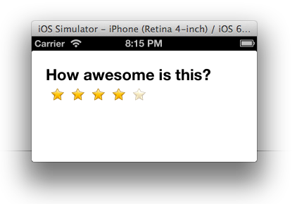

Star Rating
============
A simple star-rating widget. 

Installation & Usage
------------

1. Download and unzip the widget code.
2. Copy to your app's `app` directory -- make sure the name of the folder is `starrating`
3. In your app's config.json file, edit the dependencies section as shown:
 
            "dependencies": {
                "starrating": "1.0"
            }

4. Add the widget tag to your view's XML as shown below.  Set `max` to the number of stars you want shown, initialRating is optional and sets the starting value. 

            <Alloy>
                <Window class="container">
                    <Widget id="starwidget" src="starrating" max='5' initialRating='2.5'/>
                </Window>
            </Alloy>

5. In your controller

            $.starwidget.init(); 

For more info about importing a widget in to your project see this link: <http://docs.appcelerator.com/titanium/latest/#!/guide/Alloy_XML_Markup-section-35621528_AlloyXMLMarkup-ImportingWidgets>

#### Initialization parameters

Set in XML or TSS:

	max = 5; // total number of stars
	initialRating = 0; // initial value selected

#### Methods
	// set the current rating:
	$.starwidget.setRating(4);
	
	// get the current rating:
	var num = $.starwidget.getRating();

#### Callback

(Optionally) Pass a call back function on initialization to be called each time the user taps a star

	function doFoo(num){
		alert('Your rating = ' + num);
	}
	$.starwidget.init(doFoo);

